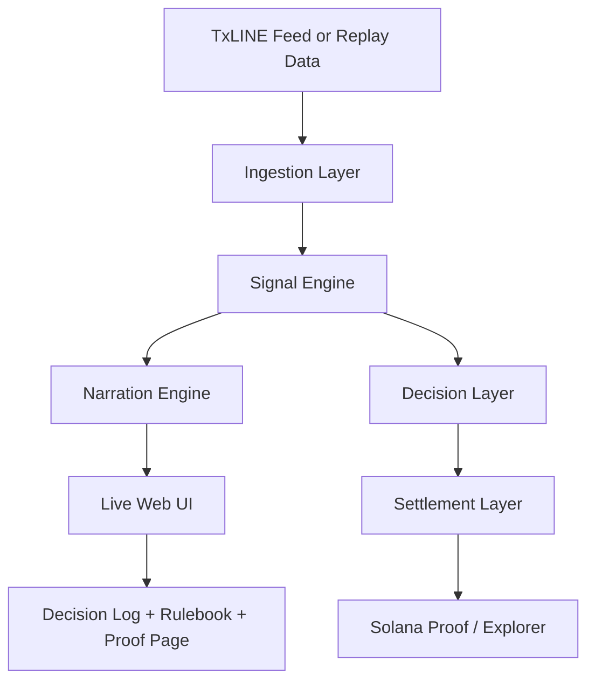

# Onside — Autonomous Settling Agent

Onside is a deterministic, explainable agent for live football markets. It watches a match, evaluates explicit rules, narrates its own decisions in plain language, and can settle a market on Solana using real match evidence and on-chain proof.

The core thesis is simple: every decision should be inspectable. Instead of relying on a black-box model, Onside makes its reasoning visible, auditable, and reproducible.

> The product is designed for transparency first: no hidden model logic, no mysterious trading behavior, and no trust-based settlement.

---

## What we have right now

Onside already combines the core building blocks of a live, demo-ready autonomous agent:

- A polished web experience for landing, live match viewing, rule exploration, and proof review
- A deterministic signal engine with named rules such as odds swings, score changes, and time-decay mismatches
- A narration layer that translates signals into human-readable commentary in real time
- An agent runtime that connects ingestion, signal evaluation, narration, decisioning, and settlement
- Settlement support for Solana devnet with multiple fallback modes: anchored settlement, memo-based proof, and simulated settlement for demos
- TxLINE-backed replay and live-mode support, with a proof page that highlights both the data verification and the settlement transaction

This makes Onside more than a concept prototype: it is a compact, end-to-end system that can be shown, tested, and improved in a live demo.

---

## Product vision

Onside exists at the intersection of three ideas:

1. Trust through transparency
   - The agent does not hide its logic behind an opaque model.
   - Every signal, confidence score, and settlement step can be traced.

2. Deterministic autonomy
   - The system is rule-based and inspectable.
   - It is designed to operate without LLM-style generation in the decision path.

3. Verifiable on-chain proof
   - The final outcome is not only declared by the agent.
   - It is backed by external match evidence and an on-chain settlement record.

This makes Onside a strong candidate for research, demo, and grant narratives around explainable automation, verifiable AI-adjacent systems, and transparent market infrastructure.

---

## Current system architecture



### Architectural layers

- Ingestion: normalizes live or replay match events into a shared event model
- Signal Engine: evaluates deterministic rules and produces confidence-scored signals
- Narration Engine: converts signals into readable commentary for users and judges
- Decision Layer: decides whether to note, open, hold, or settle based on confidence thresholds
- Settlement Layer: submits proof and settlement data to Solana devnet, with graceful fallback modes

---

## Repository structure

| Area | Purpose |
| --- | --- |
| apps/web | Vite + React interface for the landing page, live stage, rulebook, and proof page |
| packages/ingestion | Replay and TxLINE ingestion adapters behind a shared event interface |
| packages/signal-engine | Deterministic rules and config-driven confidence scoring |
| packages/narration-engine | Template-based narration generation |
| packages/agent-runtime | Orchestrator for ingest → evaluate → narrate → decide → settle |
| packages/settlement | Solana settlement flow, wallet handling, and proof generation |
| packages/txline-setup | TxLINE onboarding, fixture discovery, and replay capture helpers |

---

## What is implemented today

### Core features

- Live-style match experience with replayable fixtures
- Rule-based signal evaluation with confidence scores
- Plain-language narration stream
- Settlement proof page for demo and audit purposes
- Solana devnet settlement modes:
  - anchored settlement when a program is configured
  - memo-based proof fallback
  - simulated mode for fully offline or demo-safe execution


## Quick start

```bash
npm install
cp .env.example .env

# Headless demo pipeline
npm run demo:headless

# Web experience
npm run dev
```

Open the local app in the browser and navigate to the live stage to view the agent in action.

---

## Environment and configuration

Key environment variables include:

| Variable | Purpose |
| --- | --- |
| USE_REPLAY_MODE | Switch between replay data and live TxLINE mode |
| TXLINE_API_URL | TxLINE API endpoint |
| TXLINE_API_TOKEN | Auth token for live data access |
| TXLINE_FIXTURE_ID | Fixture to follow when running live |
| REPLAY_FILE | Alternate replay source |
| REPLAY_SPEED | Speeds up replay playback for demos |
| CONFIDENCE_SETTLE_THRESHOLD | Threshold for triggering settlement decisions |
| SOLANA_RPC_URL | Solana RPC endpoint |
| AGENT_WALLET_SECRET_KEY | Wallet used for real settlement transactions |
| ANCHOR_PROGRAM_ID | Optional on-chain program to use for anchored settlement |

---

## Current rules

The system uses auditable rules with deterministic confidence scoring:

| Rule | Trigger | Notes |
| --- | --- | --- |
| ODDS_SWING | Sharp odds movement | Confidence scales with observed movement |
| SCORE_CHANGE | Goal, red card, full-time outcome | Strong signals tied to real match events |
| TIME_DECAY_MISMATCH | Odds diverge from expected decay patterns | Useful for showing explainable market behavior |

These thresholds are intended to remain transparent and easy to tune in one place.

---

## Future vision: grant-ready and research-friendly

The next step is to position Onside not only as a demo agent, but as a platform for explainable, verifiable automation.

### Longer-term direction

- Expand from a single-match demo to a broader market-monitoring framework
- Add richer proof pipelines that combine match data, event provenance, and settlement attestations
- Formalize the rule engine as a policy layer that can be audited and compared over time
- Build stronger benchmarking and replay tooling for evaluation and reproducibility
- Create public documentation and open artifacts that make the system attractive for grants, academic partnerships, and ecosystem demos

### Why this is compelling for grants

The strongest narrative is not simply “we built an agent.” It is:

- We built a transparent autonomous system
- It is deterministic, auditable, and explainable
- It uses real-world data and produces on-chain proof
- It demonstrates a practical bridge between market logic, public infrastructure, and verifiable automation

That story fits well with themes around trustworthy automation, open infrastructure, and accountable decision systems.

---

## What we can make better next

To make the product stronger, more credible, and more demo-ready, the following improvements are the highest priority:

1. Stronger UX for explainability
   - Show the exact rule fired, the confidence score, and the supporting event in a more immersive panel
   - Make the live stage feel more like an operational control room

2. More robust settlement evidence
   - Add richer proof objects for each settlement outcome
   - Improve the trail between match evidence, rule trigger, and on-chain record

3. Better replay and benchmarking infrastructure
   - Add a larger fixture library and standardized evaluation harnesses
   - Make replay runs easier to compare and present to reviewers

4. Stronger production-grade resilience
   - Improve error handling, reconnect behavior, and fallback flows
   - Add more graceful degradation when live data or settlement services are unavailable

5. Better ecosystem positioning
   - Package the project for easier external review
   - Add a public-facing architecture note and a clearer “why this matters” narrative for investors, partners, and grant reviewers

---

## Deployment notes

The web app is designed to run locally and can also be deployed to Vercel or a similar platform. The repository already includes the necessary build and runtime wiring for the web experience and API layer.

---
